# ai-codex
AI-driven framework for Spec-Driven Development — replaces GitHub's Spec Kit templates to enforce coding principles.

## Installation

**Important:** Navigate to your project root directory before running the installation script.

### Step 1: Install spec-kit (Required)

Before installing ai-codex, you need to manually download and install spec-kit:

Please refer to [github/spec-kit](https://github.com/github/spec-kit) for installation instructions.

### Step 2: Install AI Codex

To install or update the AI Codex templates and memory files in your project:

```bash
cd /path/to/your/project  # Navigate to project root first
curl -sL https://raw.githubusercontent.com/swszz/ai-codex/main/install.sh | bash
```

Or download and run manually:

```bash
cd /path/to/your/project  # Navigate to project root first
curl -O https://raw.githubusercontent.com/swszz/ai-codex/main/install.sh
chmod +x install.sh
./install.sh
```

### Custom Installation Directory

You can specify a custom installation directory using the `INSTALL_DIR` environment variable:

```bash
INSTALL_DIR=/path/to/your/project ./install.sh
```

The script will:
1. Download the latest release from GitHub
2. Extract and install to `.specify/memory/` and `.specify/templates/` directories
3. Override duplicate files while preserving non-duplicate files in the installation directory (current directory by default)

## Spec-Kit Workflow

The AI Codex extends GitHub's Spec Kit with a structured workflow for spec-driven development. Below is the complete operation flow:

```mermaid
flowchart TD
    Start([User: Feature Description]) --> Specify["/speckit.specify<br/>Create Specification"]
    
    Specify --> SpecValidation{Spec Quality<br/>Validation}
    SpecValidation -->|Needs Clarification| ClarifyQ["Present Max 3<br/>Clarification Questions"]
    ClarifyQ --> UserAnswers["User Provides<br/>Answers"]
    UserAnswers --> UpdateSpec["Update spec.md<br/>with Answers"]
    UpdateSpec --> SpecValidation
    
    SpecValidation -->|Quality Issues| FixSpec["Auto-fix Spec<br/>Issues<br/>(Max 3 iterations)"]
    FixSpec --> SpecValidation
    
    SpecValidation -->|All Checks Pass| SpecCreated["✓ spec.md Created<br/>✓ requirements.md Checklist<br/>New Branch Created"]
    
    SpecCreated --> OptionalClarify{"/speckit.clarify<br/>Optional:<br/>Need More<br/>Clarification?"}
    OptionalClarify -->|Yes| Clarify["/speckit.clarify<br/>Detailed Clarification"]
    Clarify --> ClarifyLoop["Sequential Q&A<br/>(Max 5 Questions)<br/>with Recommendations"]
    ClarifyLoop --> UpdateClarifications["Update spec.md<br/>§Clarifications Section"]
    UpdateClarifications --> OptionalClarify
    
    OptionalClarify -->|No/Done| Plan["/speckit.plan<br/>Generate Implementation Plan"]
    
    Plan --> Constitution["Load Constitution<br/>.specify/memory/constitution.md"]
    Constitution --> TechContext["Fill Technical Context<br/>(Language, Dependencies, etc.)"]
    TechContext --> ResearchNeeded{NEEDS<br/>CLARIFICATION<br/>Exists?}
    
    ResearchNeeded -->|Yes| Phase0["Phase 0: Research<br/>- Resolve unknowns<br/>- Best practices<br/>- Technology choices<br/>→ research.md"]
    ResearchNeeded -->|No| Phase1
    Phase0 --> Phase1["Phase 1: Design<br/>- Data models<br/>- API contracts<br/>- Quickstart guide<br/>→ data-model.md<br/>→ contracts/<br/>→ quickstart.md"]
    
    Phase1 --> UpdateAgent["Update Agent Context<br/>(GitHub Copilot, etc.)"]
    UpdateAgent --> ConstitutionCheck{Constitution<br/>Gates Pass?}
    
    ConstitutionCheck -->|Violations| Error1["ERROR: Fix Violations<br/>or Justify Complexity"]
    Error1 --> Plan
    ConstitutionCheck -->|Pass| PlanComplete["✓ plan.md Complete<br/>✓ All Design Artifacts"]
    
    PlanComplete --> OptionalChecklist{"/speckit.checklist<br/>Optional:<br/>Custom Quality<br/>Checklists?"}
    
    OptionalChecklist -->|Yes| Checklist["/speckit.checklist<br/>Generate Quality Checklist"]
    Checklist --> ChecklistQuestions["Dynamic Q&A<br/>(Max 5 Questions)<br/>Determine Focus"]
    ChecklistQuestions --> GenerateChecklist["Generate Checklist<br/>'Unit Tests for Requirements'<br/>→ checklists/[domain].md"]
    GenerateChecklist --> OptionalChecklist
    
    OptionalChecklist -->|No/Done| Tasks["/speckit.tasks<br/>Generate Task Breakdown"]
    
    Tasks --> LoadDesign["Load Design Artifacts<br/>- spec.md (user stories)<br/>- plan.md (tech stack)<br/>- data-model.md (entities)<br/>- contracts/ (endpoints)"]
    LoadDesign --> GenerateTasks["Generate tasks.md<br/>Organized by User Story<br/>(P1, P2, P3...)"]
    
    GenerateTasks --> TaskPhases["Task Phases:<br/>1. Setup<br/>2. Foundational (blocks all stories)<br/>3-N. User Stories (P1→P2→P3)<br/>Final. Polish & Integration"]
    TaskPhases --> TasksComplete["✓ tasks.md Complete<br/>✓ Dependency Graph<br/>✓ Parallel Opportunities"]
    
    TasksComplete --> OptionalAnalyze{"/speckit.analyze<br/>Optional:<br/>Cross-Artifact<br/>Analysis?"}
    
    OptionalAnalyze -->|Yes| Analyze["/speckit.analyze<br/>Quality Analysis"]
    Analyze --> AnalysisChecks["Read-Only Analysis:<br/>- Duplication Detection<br/>- Ambiguity Detection<br/>- Coverage Gaps<br/>- Constitution Alignment<br/>- Consistency Checks"]
    AnalysisChecks --> AnalysisReport["Generate Analysis Report<br/>- Findings by Severity<br/>- Coverage Metrics<br/>- Remediation Suggestions"]
    AnalysisReport --> CriticalIssues{Critical<br/>Issues?}
    CriticalIssues -->|Yes| FixIssues["User: Fix Issues<br/>Re-run /specify, /plan, or /tasks"]
    FixIssues --> OptionalAnalyze
    CriticalIssues -->|No| OptionalAnalyze
    
    OptionalAnalyze -->|No/Approved| Implement["/speckit.implement<br/>Execute Implementation"]
    
    Implement --> CheckChecklists["Check Checklists Status<br/>(if checklists/ exists)"]
    CheckChecklists --> ChecklistsComplete{All Checklists<br/>Complete?}
    ChecklistsComplete -->|No| AskProceed["Ask User:<br/>Proceed Anyway?"]
    AskProceed -->|No| WaitUser["Wait for User<br/>to Complete Checklists"]
    WaitUser --> CheckChecklists
    AskProceed -->|Yes| LoadContext
    ChecklistsComplete -->|Yes| LoadContext["Load Implementation Context<br/>- tasks.md (required)<br/>- plan.md (required)<br/>- All design artifacts"]
    
    LoadContext --> VerifyIgnore["Setup Ignore Files<br/>.gitignore, .dockerignore, etc."]
    VerifyIgnore --> ParseTasks["Parse Task Structure<br/>Extract Dependencies"]
    ParseTasks --> ExecutePhases["Execute Phase by Phase:<br/>1. Setup<br/>2. Foundational (must complete first)<br/>3-N. User Stories (can be parallel)<br/>Final. Polish"]
    
    ExecutePhases --> TDD{Tests<br/>Requested?}
    TDD -->|Yes| WriteTests["Write Tests FIRST<br/>Ensure They FAIL"]
    WriteTests --> ImplementCode["Implement Code"]
    TDD -->|No| ImplementCode
    
    ImplementCode --> ValidatePhase["Validate Phase Completion<br/>Mark Tasks Complete [X]"]
    ValidatePhase --> MorePhases{More<br/>Phases?}
    MorePhases -->|Yes| ExecutePhases
    MorePhases -->|No| FinalValidation["Final Validation:<br/>- All tasks complete<br/>- Tests pass<br/>- Matches spec"]
    
    FinalValidation --> Complete["✓ Implementation Complete<br/>✓ Feature Ready"]
    Complete --> End([End: Feature Delivered])
    
    style Start fill:#e1f5ff
    style End fill:#e1f5ff
    style SpecCreated fill:#d4edda
    style PlanComplete fill:#d4edda
    style TasksComplete fill:#d4edda
    style Complete fill:#d4edda
    style Error1 fill:#f8d7da
    style Constitution fill:#fff3cd
    style ConstitutionCheck fill:#fff3cd
    style TDD fill:#d1ecf1
    style WriteTests fill:#d1ecf1
```



### Workflow Phases Explained

#### 1. Specification Phase (`/speckit.specify`)
- **Input**: Natural language feature description
- **Process**: 
  - Creates feature branch and spec.md
  - Validates specification quality automatically
  - Presents up to 3 clarification questions if needed
  - Creates requirements.md quality checklist
- **Output**: spec.md, checklists/requirements.md
- **Constitution**: Enforces "Clarity Before Code" principle

#### 2. Clarification Phase (`/speckit.clarify`) - Optional
- **Input**: Existing spec.md
- **Process**:
  - Analyzes spec for ambiguities across 10+ dimensions
  - Asks up to 5 targeted questions sequentially
  - Provides recommendations for each question
  - Updates spec with clarifications
- **Output**: Updated spec.md with §Clarifications section
- **Best Practice**: Run before planning to reduce rework

#### 3. Planning Phase (`/speckit.plan`)
- **Input**: spec.md, constitution.md
- **Process**:
  - **Phase 0**: Research and resolve technical unknowns → research.md
  - **Phase 1**: Generate design artifacts:
    - Data models → data-model.md
    - API contracts → contracts/
    - Integration guide → quickstart.md
  - Updates agent context for AI assistants
  - Validates against constitution gates
- **Output**: plan.md, research.md, data-model.md, contracts/, quickstart.md
- **Constitution**: Enforces all 7 core principles

#### 4. Checklist Generation (`/speckit.checklist`) - Optional
- **Input**: spec.md, plan.md, tasks.md
- **Process**:
  - Dynamic Q&A to determine checklist focus
  - Generates "unit tests for requirements"
  - Tests requirement quality, not implementation
  - Creates domain-specific checklists (ux.md, security.md, api.md, etc.)
- **Output**: checklists/[domain].md
- **Purpose**: Validate requirements completeness, clarity, consistency

#### 5. Task Breakdown (`/speckit.tasks`)
- **Input**: spec.md (user stories), plan.md (tech stack), design artifacts
- **Process**:
  - Organizes tasks by user story priority (P1, P2, P3)
  - Identifies parallel execution opportunities [P]
  - Creates dependency graph
  - Phases: Setup → Foundational → User Stories → Polish
- **Output**: tasks.md with numbered tasks (T001, T002...)
- **Key Feature**: Each user story is independently implementable and testable

#### 6. Analysis Phase (`/speckit.analyze`) - Optional
- **Input**: spec.md, plan.md, tasks.md, constitution.md
- **Process**:
  - Read-only cross-artifact analysis
  - Detects: duplications, ambiguities, gaps, conflicts
  - Validates constitution alignment
  - Generates coverage metrics
- **Output**: Analysis report with severity-ranked findings
- **Best Practice**: Run before implementation to catch issues early

#### 7. Implementation Phase (`/speckit.implement`)
- **Input**: tasks.md, all design artifacts
- **Process**:
  - Checks checklist completion status
  - Verifies project setup (ignore files, etc.)
  - Executes tasks phase-by-phase
  - Follows TDD approach if tests requested
  - Marks tasks complete [X] as they finish
- **Output**: Implemented feature matching specification
- **Constitution**: Enforces "Test code is required" principle

### Key Concepts

#### Constitution Gates
The `.specify/memory/constitution.md` defines 7 non-negotiable principles:
1. **Test code is required** - All tests must pass before commit
2. **Clarity Before Code** - Never start with ambiguous requirements
3. **Simplicity First** - YAGNI, abstraction only after 3+ patterns
4. **Security by Default** - No hardcoded secrets, validate all inputs
5. **Observability Required** - Structured logging, meaningful errors
6. **Documentation Alongside Code** - Comments for "why", README setup < 10 min
7. **Backward Compatibility** - 1 version deprecation period, forward-only migrations

#### User Story Organization
Tasks are grouped by user story (P1, P2, P3) to enable:
- Independent implementation
- Independent testing
- Incremental MVP delivery
- Parallel team development

#### Templates & Memory
- **Templates** (`.specify/templates/`): Scaffolding for all generated artifacts
- **Memory** (`.specify/memory/`): Project constitution and coding principles
- **Scripts** (`install.sh`): Automated installation of templates and memory
- **Agent Files**: Context for AI assistants (GitHub Copilot, etc.)
